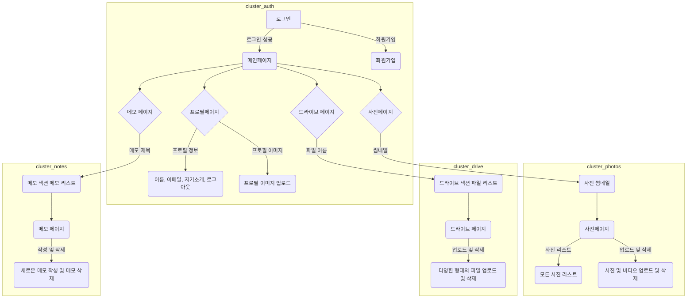
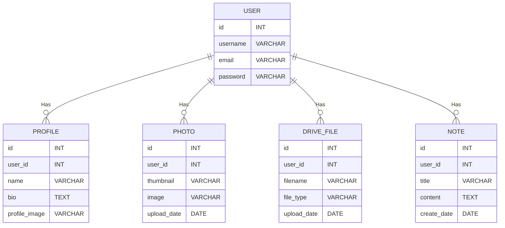

# blog_website_jShop
Django를 활용한 쇼핑몰

# blog_website_jStory
Django를 활용한 Blog

# jCloud

Django 활용 페이지 제작 프로젝트

# URL 구조(모놀리식)

### accounts App

| URL                                   | Views Function         |    HTML                         | Note                           |
|---------------------------------------|------------------------|----------------------------------------|--------------------------------|
| '/accounts/login/'                    | login_view             | accounts/login.html                   | 로그인 화면                   |
| '/accounts/logout/'                   | logout_view            |      accounts/logout.html                               | 로그아웃 기능                 |
| '/accounts/signup/'                   | signup_view            | accounts/signup.html                  | 회원가입 화면               |

### profile_index App

| URL                                   | Views Function         | HTML                         | Note                           |
|---------------------------------------|------------------------|----------------------------------------|--------------------------------|
| '/profile_index/'                           | profile_index                | profile_index/profile.html                  | 프로필 화면                   |
| '/profile_content/'                           | profile_content                | profile_content/profile_content.html                  | 프로필 화면                   |

### photos App

| URL                                   | Views Function         | HTML                        | Note                           |
|---------------------------------------|------------------------|----------------------------------------|--------------------------------|
| '/photos/view/'                       | photo_list             | photos/photo_list.html                | 모든 사진 및 비디오 리스트    |
| '/photos/upload/'                     | photo_upload           | photos/photo_upload.html              | 사진 및 비디오 업로드 화면   |
| '/photos/delete/<int:photo_id>/'      | photo_delete           |                                     | 사진 및 비디오 삭제 기능     |

### drive App

| URL                                   | Views Function         | HTML                        | Note                           |
|---------------------------------------|------------------------|----------------------------------------|--------------------------------|
| '/drive/'                             | drive_files            | drive/drive_files.html                 | 드라이브 섹션 파일 리스트      |
| '/drive/upload/'                      | drive_upload           | drive/drive_upload.html                | 파일 업로드 화면             |
| '/drive/delete/<int:file_id>/'        | drive_delete           |                                     | 파일 삭제 기능               |

### notes App

| URL                                   | Views Function         | HTML                        | Note                           |
|---------------------------------------|------------------------|----------------------------------------|--------------------------------|
| '/notes/'                             | note_list              | notes/note_list.html                   | 메모 섹션 메모 리스트        |
| '/notes/create/'                      | note_create            | notes/note_create.html                 | 새로운 메모 작성 화면       |
| '/notes/delete/<int:note_id>/'        | note_delete            |                                     | 메모 삭제 기능               |

# 요구사항 구현

# DB 구성

