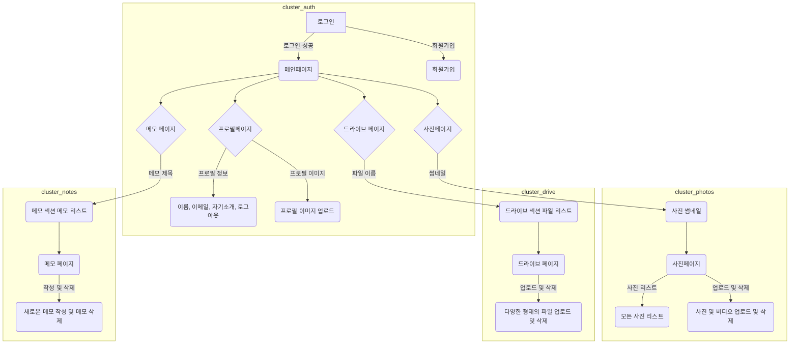
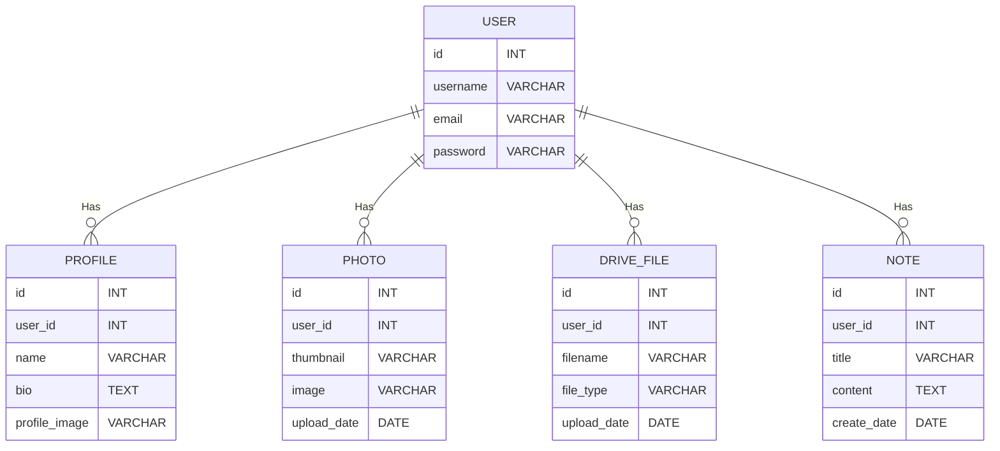

# blog_website_jShop
Django를 활용한 쇼핑몰

# URL 구조(모놀리식)

### accounts App

| URL                                   | Views Function         |    HTML                         | Note                           |
|---------------------------------------|------------------------|----------------------------------------|--------------------------------|
| '/accounts/login/'                    | login_view             | accounts/login.html                   | 로그인 화면                   |
| '/accounts/logout/'                   | logout_view            |      accounts/logout.html                               | 로그아웃 기능                 |
| '/accounts/signup/'                   | signup_view            | accounts/signup.html                  | 회원가입 화면               |

### profile_index App

| URL                                   | Views Function         | HTML                         | Note                           |
|---------------------------------------|------------------------|----------------------------------------|--------------------------------|
| '/profile_index/'                           | profile_index                | profile_index/profile.html                  | 프로필 화면                   |
| '/profile_content/'                           | profile_content                | profile_content/profile_content.html                  | 프로필 화면                   |

### photos App

| URL                                   | Views Function         | HTML                        | Note                           |
|---------------------------------------|------------------------|----------------------------------------|--------------------------------|
| '/photos/view/'                       | photo_list             | photos/photo_list.html                | 모든 사진 및 비디오 리스트    |
| '/photos/upload/'                     | photo_upload           | photos/photo_upload.html              | 사진 및 비디오 업로드 화면   |
| '/photos/delete/<int:photo_id>/'      | photo_delete           |                                     | 사진 및 비디오 삭제 기능     |

### drive App

| URL                                   | Views Function         | HTML                        | Note                           |
|---------------------------------------|------------------------|----------------------------------------|--------------------------------|
| '/drive/'                             | drive_files            | drive/drive_files.html                 | 드라이브 섹션 파일 리스트      |
| '/drive/upload/'                      | drive_upload           | drive/drive_upload.html                | 파일 업로드 화면             |
| '/drive/delete/<int:file_id>/'        | drive_delete           |                                     | 파일 삭제 기능               |

### notes App

| URL                                   | Views Function         | HTML                        | Note                           |
|---------------------------------------|------------------------|----------------------------------------|--------------------------------|
| '/notes/'                             | note_list              | notes/note_list.html                   | 메모 섹션 메모 리스트        |
| '/notes/create/'                      | note_create            | notes/note_create.html                 | 새로운 메모 작성 화면       |
| '/notes/delete/<int:note_id>/'        | note_delete            |                                     | 메모 삭제 기능               |


# 요구사항 구현



# DB 구성



# 트러블 슈팅

📦templates
 ┣ 📂accounts
 ┃ ┣ 📜login.html
 ┃ ┗ 📜logout.html
 ┣ 📂store
 ┃ ┣ 📜about.html
 ┃ ┣ 📜home.html
 ┃ ┗ 📜navbar.html
 ┗ 📜base.html

### 에러상황 1
에러발견 store 와 accounts 로 app이 분리 되어 있는 상황에서 store > navbar.html 에서  페이지의 상단 위 버튼을 클릭하면 login 페이지로 이동하게 하려고 했다. 그 이유로 아래와 같은 코드를 작성했지만 
작동이 되지 않았다. 
```python
<li class="nav-item"><a class="nav-link" href="">Login</a></li>
<li class="nav-item"><a class="nav-link" href="">Logout</a></li>
```

### 에러해결방법

### 해결 시도 1.1
파일이름을 지정 해서 에러를 해결하려함  >>> 결과 실패 

코드변경
```python
<li class="nav-item"><a class="nav-link" href="">Login</a></li>
<li class="nav-item"><a class="nav-link" href="">Logout</a></li>
                
```
### 해결 시도 1.2
위의 코드와 추가로 accounts 앱의 urls.py 로 이동하여 URL 네임스페이스지정
```python
    app_name = 'accounts'
```
### 해결 시도 1.3
accounts 의views.py 를 검토 중 아래 코드를 발견하고 html 앞에 폴더 경로를 추가

수정 전
```python
    def login(request):
        return render(request, "login.html")


    def logout(request):
        return render(request, "logout.html")
```

수정 후
```python
    def login(request):
        return render(request, "accounts/login.html")


    def logout(request):
        return render(request, "accounts/logout.html")
```
### 에러상황 2
navbar에 카테고리 검색창을 만들어 클릭을 통해 카테고리를 분류할려고 시도 했었다. 그때 url 주소에 가시성을 주고 싶어서 한글로 지정을 해보았는데 그래서 아래의 코드로 시작을 하게 되었다.

```python
<li><a class="dropdown-item" href="">휴대폰</a></li>
<li><a class="dropdown-item" href="">도서</a></li>
<li><a class="dropdown-item" href="">과일</a></li>
<li><a class="dropdown-item" href="">스포츠</a></li>
```
### 해결 시도 2.1
quote() , parse 등을 찾아서 해결해 보려고 했으나 계속 찾아본 결과 url 주소 창에는 영어로 하는 것이 좀 더 선호되는 올바른 방향성이다 판단을 하였다. 
그래서 관리자 페이지의 db 에서 category 라는 부분에 한글로 되어있던 데이터들을 영어로 수정하였다. 그리고 코드를 아래와 같이 db name 에 맞게 변경해 주었다.
```python
<li><a class="dropdown-item" href="">휴대폰</a></li>
<li><a class="dropdown-item" href="">도서</a></li>
<li><a class="dropdown-item" href="">과일</a></li>
<li><a class="dropdown-item" href="">스포츠</a></li>
```


### 에러해결 후 회고
처음 store라는 앱에서 모든 html 을 만들어 진행을 하다 기능을 추가 하고 싶은 욕심에 앱을 분리해야겠다고 생각하고 코드를 수정하는 과정에서 발생한 에러이다.

이번 기회로 app_name 을 지정해주는 것에 대한 의미와 효과를 제대로 알게 되었다.
또한 서로 다른 앱에서 html을 연동시키고 싶을 때 url.py 와 views.py 그리고 templates 를 활용하는 방법을 이해했다.
