# Django를 활용한 쇼핑몰

## 1. 목표와 기능

### 1.1 목표

- Django를 활용한 개인프로젝트
- 초기 기능 정의 및 화면 기획 진행
- 쇼핑몰을 주제로 CRUD 구현하기 
- 모놀리식 아키텍쳐 설계
- Django FBV을 통한 개발
- WBS 및 ERD 정의 및 작성 

### 1.2 기능

accounts app:

- Profile 모델: 사용자 프로필 정보를 저장합니다. 이메일, 비밀번호, 전화번호, 주소 등을 관리할 수 있습니다.

store app:

- Category 모델: 상품 카테고리를 저장합니다.
- Customer 모델: 고객 정보를 저장합니다.
- Product 모델: 상품 정보를 저장합니다. 가격, 카테고리, 설명, 이미지 등을 포함합니다.
- Order 모델: 주문 정보를 저장합니다. 주문한 상품, 고객, 수량, 주소, 전화번호, 주문일 및 주문 상태를 포함합니다.

cart app:

- Cart 클래스: 장바구니 관련 기능을 처리합니다. 장바구니에 상품 추가, 총 가격 계산, 장바구니에 담긴 상품 정보 반환 등을 처리합니다.

payment app:

- ShippingAddress 모델: 배송지 주소 정보를 저장합니다. 사용자, 이메일, 주소 등을 관리할 수 있습니다.

## 2. 개발 환경 및 배포 URL
### 2.1 개발 환경

- Web Framework
  - Django 5.0.3 (Python 3.12.1)
  - bootstrap

### 2.2 URL 구조(모놀리식)
- **config (main)**

| App       | URL                                        | Views Function    | HTML File Name               | Note           |
|-----------|--------------------------------------------|-------------------|------------------------------|----------------|
| config    | 'admin/'                                   | (N/A)             | (N/A)                        | Django Admin   |
| config    | ''                                         | home              | store/home.html              | 홈화면
| config    | 'accounts/'                                | (N/A)             | (N/A)                        | accounts.urls include 참조|
| config    | 'cart/'                                    | (N/A)             | (N/A)                        | cart.urls include 참조|
| config    | 'payment/'                                 | (N/A)             | (N/A)                        | payment.urls include 참조|


- **accounts**

| App       | URL                                        | Views Function    | HTML File Name                        | Note           |
|-----------|--------------------------------------------|-------------------|---------------------------------------|----------------|
| accounts  | 'login/'                                   | login_user        | accounts/login.html                   | 로그인         |
| accounts  | 'logout/'                                  | logout_user       | accounts/logout.html                  | 로그아웃       |
| accounts  | 'register/'                                | register_user     | accounts/register.html                | 회원가입       |
| accounts  | 'update_user/'                             | update_user       | accounts/update_user.html             | 프로필 변경       |
| accounts  | 'update_password/'                         | update_password   | accounts/update_password.html         | 비밀번호 변경       |
| accounts  | 'update_info/'                             | update_info       | accounts/update_info.html             | 사용자 정보 변경       |

- **cart**

| App       | URL                                        | Views Function    | HTML File Name                        | Note           |
|-----------|--------------------------------------------|-------------------|---------------------------------------|----------------|
| cart      | ''                                         | cart_summary      | cart/cart_summary.html                | 장바구니  |
| cart      | 'add/'                                     | cart_add          | (N/A)                                 | 상품 추가      |
| cart      | 'delete/'                                  | cart_delete       | (N/A)                                 | 상품 삭제      |
| cart      | 'update/'                                  | cart_update       | (N/A)                                 | 상품 수량 변경 |

- **payment**

| App       | URL                                        | Views Function    | HTML File Name                        | Note           |
|-----------|--------------------------------------------|-------------------|---------------------------------------|----------------|
| pay       | 'payment_success/'                         | payment_success   | payment/payment_success.html          | 결제 화면 |

- **store**

| App       | URL                                        | Views Function    | HTML File Name                        | Note           |
|-----------|--------------------------------------------|-------------------|---------------------------------------|----------------|
| store     | ''                                         | home              | store/home.html                       | 홈화면          |
| store     | 'about/'                                   | about             | store/about.html                      | 소개 화면             |
| store     | 'product/<int:pk>'                         | product           | store/product.html                    | 상품 상세 화면  |
| store     | 'category/<str:s>'                         | category          | store/category.html                   | 상품별 카테고리 페이지 |
| store     | 'category_summary/'                        | category_summary  | store/category_summary.html           | 전체 카테고리 페이지 |
| store     | 'search/'                                  | search            | store/search.html                     | 검색 결과 페이지 |


## 3. 요구사항 명세와 기능 명세


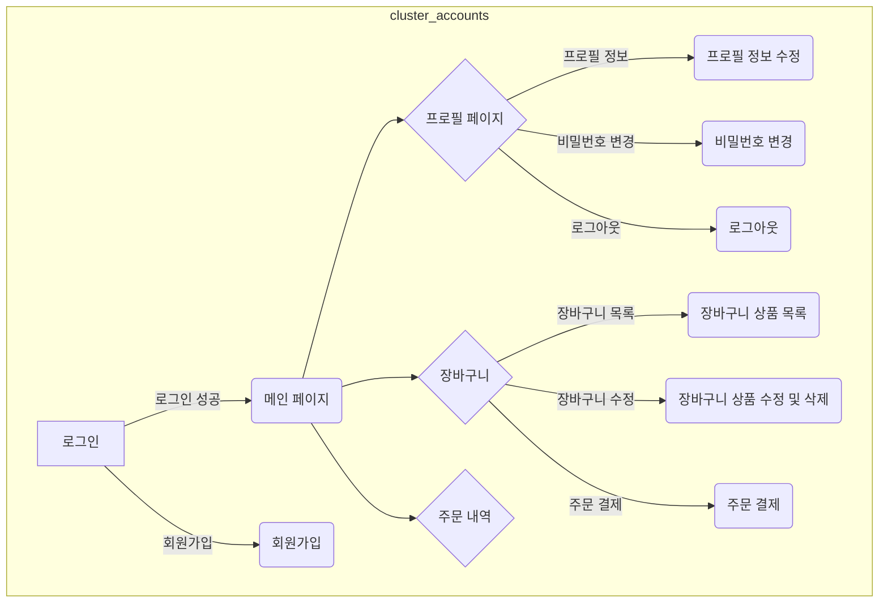

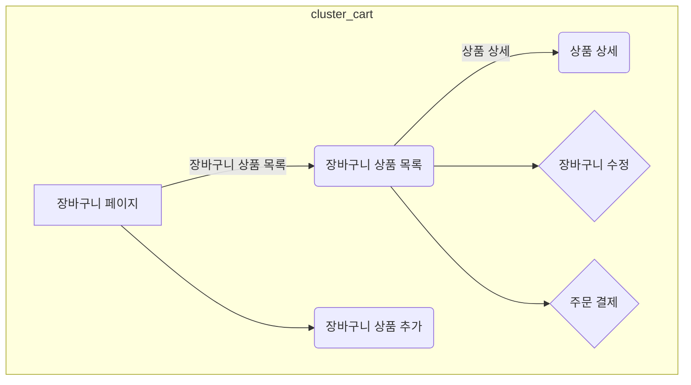

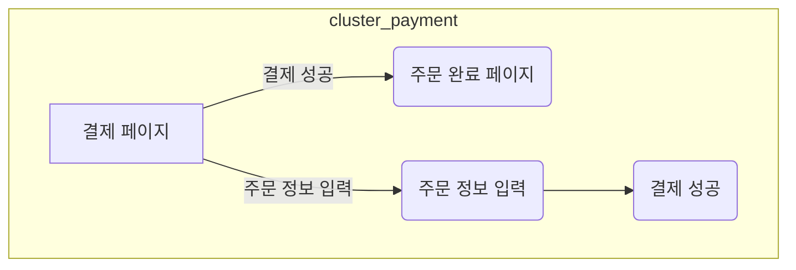

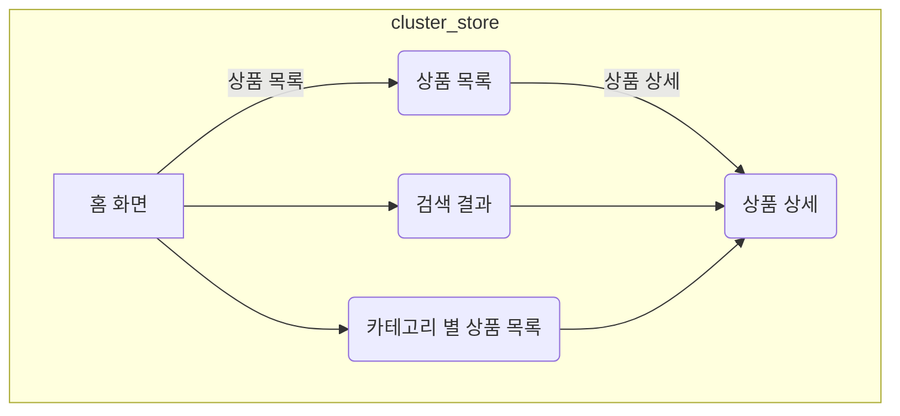

## 4. 프로젝트 구조와 개발 일정
### 4.1 프로젝트 구조
```
📦jShop
 ┣ 📂accounts
 ┃ ┣ 📂migrations
 ┃ ┃ ┣ 📂__pycache__
 ┃ ┃ ┃ ┣ 📜0001_initial.cpython-312.pyc
 ┃ ┃ ┃ ┣ 📜0002_profile_old_cart.cpython-312.pyc
 ┃ ┃ ┃ ┗ 📜__init__.cpython-312.pyc
 ┃ ┃ ┣ 📜0001_initial.py
 ┃ ┃ ┣ 📜0002_profile_old_cart.py
 ┃ ┃ ┗ 📜__init__.py
 ┃ ┣ 📂__pycache__
 ┃ ┃ ┣ 📜admin.cpython-312.pyc
 ┃ ┃ ┣ 📜apps.cpython-312.pyc
 ┃ ┃ ┣ 📜forms.cpython-312.pyc
 ┃ ┃ ┣ 📜models.cpython-312.pyc
 ┃ ┃ ┣ 📜urls.cpython-312.pyc
 ┃ ┃ ┣ 📜views.cpython-312.pyc
 ┃ ┃ ┗ 📜__init__.cpython-312.pyc
 ┃ ┣ 📜admin.py
 ┃ ┣ 📜apps.py
 ┃ ┣ 📜forms.py
 ┃ ┣ 📜models.py
 ┃ ┣ 📜tests.py
 ┃ ┣ 📜urls.py
 ┃ ┣ 📜views.py
 ┃ ┗ 📜__init__.py
 ┣ 📂cart
 ┃ ┣ 📂migrations
 ┃ ┃ ┣ 📂__pycache__
 ┃ ┃ ┃ ┗ 📜__init__.cpython-312.pyc
 ┃ ┃ ┗ 📜__init__.py
 ┃ ┣ 📂__pycache__
 ┃ ┃ ┣ 📜admin.cpython-312.pyc
 ┃ ┃ ┣ 📜apps.cpython-312.pyc
 ┃ ┃ ┣ 📜cart.cpython-312.pyc
 ┃ ┃ ┣ 📜context_processors.cpython-312.pyc
 ┃ ┃ ┣ 📜models.cpython-312.pyc
 ┃ ┃ ┣ 📜urls.cpython-312.pyc
 ┃ ┃ ┣ 📜views.cpython-312.pyc
 ┃ ┃ ┗ 📜__init__.cpython-312.pyc
 ┃ ┣ 📜admin.py
 ┃ ┣ 📜apps.py
 ┃ ┣ 📜cart.py
 ┃ ┣ 📜context_processors.py
 ┃ ┣ 📜models.py
 ┃ ┣ 📜tests.py
 ┃ ┣ 📜urls.py
 ┃ ┣ 📜views.py
 ┃ ┗ 📜__init__.py
 ┣ 📂config
 ┃ ┣ 📂__pycache__
 ┃ ┃ ┣ 📜settings.cpython-312.pyc
 ┃ ┃ ┣ 📜urls.cpython-312.pyc
 ┃ ┃ ┣ 📜wsgi.cpython-312.pyc
 ┃ ┃ ┗ 📜__init__.cpython-312.pyc
 ┃ ┣ 📜asgi.py
 ┃ ┣ 📜settings.py
 ┃ ┣ 📜urls.py
 ┃ ┣ 📜wsgi.py
 ┃ ┗ 📜__init__.py
 ┣ 📂media
 ┃ ┗ 📂uploads
 ┃ ┃ ┗ 📂product
 ┃ ┃ ┃ ┣ 📜PyGame_어드벤쳐_위니브_월드를_수복하라.png
 ┃ ┃ ┃ ┣ 📜React_Hook_들어오네.png
 ┃ ┃ ┃ ┣ 📜갤럭시_노트_5.jpg
 ┃ ┃ ┃ ┣ 📜갤럭시_노트_7.jpg
 ┃ ┃ ┃ ┣ 📜글러브.jpg
 ┃ ┃ ┃ ┣ 📜농구공.jpg
 ┃ ┃ ┃ ┣ 📜딸기.jpg
 ┃ ┃ ┃ ┣ 📜라임.jpg
 ┃ ┃ ┃ ┣ 📜라임_CuVwFzn.jpg
 ┃ ┃ ┃ ┣ 📜레몬.jpg
 ┃ ┃ ┃ ┣ 📜바나나.jpg
 ┃ ┃ ┃ ┣ 📜방울토마토.jpg
 ┃ ┃ ┃ ┣ 📜배드민턴채.jpg
 ┃ ┃ ┃ ┣ 📜블루베리.jpg
 ┃ ┃ ┃ ┣ 📜산딸기.jpg
 ┃ ┃ ┃ ┣ 📜셔틀콕.jpg
 ┃ ┃ ┃ ┣ 📜수박.jpg
 ┃ ┃ ┃ ┣ 📜아이폰15.jpg
 ┃ ┃ ┃ ┣ 📜아이폰_11.jpg
 ┃ ┃ ┃ ┣ 📜아이폰_14.jpg
 ┃ ┃ ┃ ┣ 📜악력운동기.jpg
 ┃ ┃ ┃ ┣ 📜알아서_잘_딱_깔끔하고_센스있게_정리하는_GitHub_핵심_개념.png
 ┃ ┃ ┃ ┣ 📜오렌지.jpg
 ┃ ┃ ┃ ┣ 📜요가매트.jpg
 ┃ ┃ ┃ ┣ 📜웹_접근성_왭Why-Web.png
 ┃ ┃ ┃ ┣ 📜위니브_월드_새로운_시대.png
 ┃ ┃ ┃ ┣ 📜제트플립_5.jpg
 ┃ ┃ ┃ ┣ 📜줄넘기.jpg
 ┃ ┃ ┃ ┣ 📜짐볼.jpg
 ┃ ┃ ┃ ┣ 📜축구공.jpg
 ┃ ┃ ┃ ┣ 📜케틀벨.jpg
 ┃ ┃ ┃ ┣ 📜케틀벨_16kg.jpg
 ┃ ┃ ┃ ┣ 📜케틀벨_32kg.jpg
 ┃ ┃ ┃ ┣ 📜케틀벨_8kg.jpg
 ┃ ┃ ┃ ┣ 📜키위.jpg
 ┃ ┃ ┃ ┣ 📜타입스크립트_넌_내_타입.png
 ┃ ┃ ┃ ┗ 📜풋사과.jpg
 ┣ 📂payment
 ┃ ┣ 📂migrations
 ┃ ┃ ┣ 📂__pycache__
 ┃ ┃ ┃ ┣ 📜0001_initial.cpython-312.pyc
 ┃ ┃ ┃ ┣ 📜0002_alter_shippingaddress_options.cpython-312.pyc
 ┃ ┃ ┃ ┗ 📜__init__.cpython-312.pyc
 ┃ ┃ ┣ 📜0001_initial.py
 ┃ ┃ ┣ 📜0002_alter_shippingaddress_options.py
 ┃ ┃ ┗ 📜__init__.py
 ┃ ┣ 📂__pycache__
 ┃ ┃ ┣ 📜admin.cpython-312.pyc
 ┃ ┃ ┣ 📜apps.cpython-312.pyc
 ┃ ┃ ┣ 📜models.cpython-312.pyc
 ┃ ┃ ┣ 📜urls.cpython-312.pyc
 ┃ ┃ ┣ 📜views.cpython-312.pyc
 ┃ ┃ ┗ 📜__init__.cpython-312.pyc
 ┃ ┣ 📜admin.py
 ┃ ┣ 📜apps.py
 ┃ ┣ 📜models.py
 ┃ ┣ 📜tests.py
 ┃ ┣ 📜urls.py
 ┃ ┣ 📜views.py
 ┃ ┗ 📜__init__.py
 ┣ 📂static
 ┃ ┣ 📂assets
 ┃ ┃ ┗ 📜favicon.ico
 ┃ ┣ 📂css
 ┃ ┃ ┗ 📜styles.css
 ┃ ┣ 📂js
 ┃ ┃ ┗ 📜scripts.js
 ┃ ┗ 📜index.html
 ┣ 📂store
 ┃ ┣ 📂migrations
 ┃ ┃ ┣ 📂__pycache__
 ┃ ┃ ┃ ┣ 📜0001_initial.cpython-312.pyc
 ┃ ┃ ┃ ┣ 📜0002_alter_product_price.cpython-312.pyc
 ┃ ┃ ┃ ┣ 📜0003_alter_category_options_product_is_sale_and_more.cpython-312.pyc
 ┃ ┃ ┃ ┣ 📜0004_profile.cpython-312.pyc
 ┃ ┃ ┃ ┣ 📜0005_delete_profile.cpython-312.pyc
 ┃ ┃ ┃ ┗ 📜__init__.cpython-312.pyc
 ┃ ┃ ┣ 📜0001_initial.py
 ┃ ┃ ┣ 📜0002_alter_product_price.py
 ┃ ┃ ┣ 📜0003_alter_category_options_product_is_sale_and_more.py
 ┃ ┃ ┣ 📜0004_profile.py
 ┃ ┃ ┣ 📜0005_delete_profile.py
 ┃ ┃ ┗ 📜__init__.py
 ┃ ┣ 📂__pycache__
 ┃ ┃ ┣ 📜admin.cpython-312.pyc
 ┃ ┃ ┣ 📜apps.cpython-312.pyc
 ┃ ┃ ┣ 📜models.cpython-312.pyc
 ┃ ┃ ┣ 📜urls.cpython-312.pyc
 ┃ ┃ ┣ 📜views.cpython-312.pyc
 ┃ ┃ ┗ 📜__init__.cpython-312.pyc
 ┃ ┣ 📜admin.py
 ┃ ┣ 📜apps.py
 ┃ ┣ 📜models.py
 ┃ ┣ 📜tests.py
 ┃ ┣ 📜urls.py
 ┃ ┣ 📜views.py
 ┃ ┗ 📜__init__.py
 ┣ 📂templates
 ┃ ┣ 📂accounts
 ┃ ┃ ┣ 📜login.html
 ┃ ┃ ┣ 📜register.html
 ┃ ┃ ┣ 📜update_info.html
 ┃ ┃ ┣ 📜update_password.html
 ┃ ┃ ┗ 📜update_user.html
 ┃ ┣ 📂cart
 ┃ ┃ ┗ 📜cart_summary.html
 ┃ ┣ 📂payment
 ┃ ┃ ┗ 📜payment_success.html
 ┃ ┣ 📂store
 ┃ ┃ ┣ 📜about.html
 ┃ ┃ ┣ 📜category.html
 ┃ ┃ ┣ 📜category_summary.html
 ┃ ┃ ┣ 📜home.html
 ┃ ┃ ┣ 📜navbar.html
 ┃ ┃ ┣ 📜product.html
 ┃ ┃ ┗ 📜search.html
 ┃ ┗ 📜base.html
 ┣ 📜.env
 ┣ 📜db.sqlite3
 ┗ 📜manage.py
 ```

### 4.1 개발 일정(WBS)
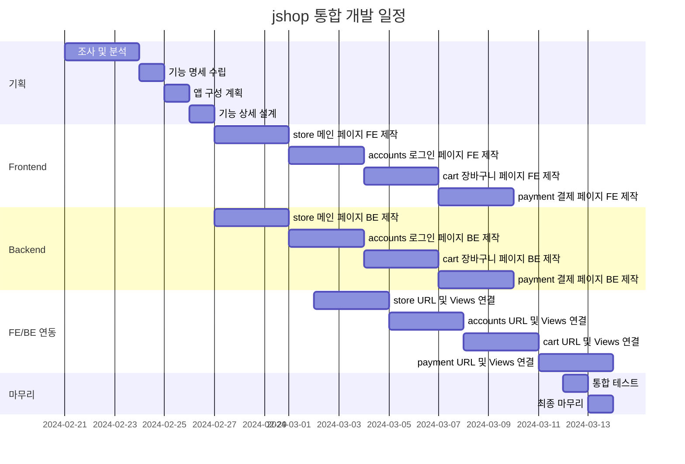
## 5. 와이어프레임 / UI / BM

### 5.1 와이어프레임

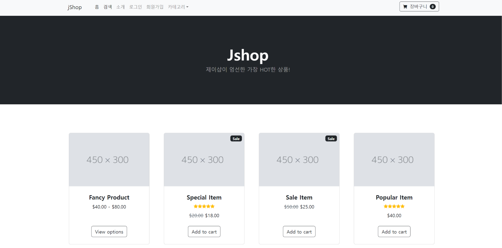

### 5.2 화면 설계

## 화면 설계

<table>
    <tbody>
        <tr>
            <td>메인</td>
            <td>소개</td>
        </tr>
        <tr>
            <td>
                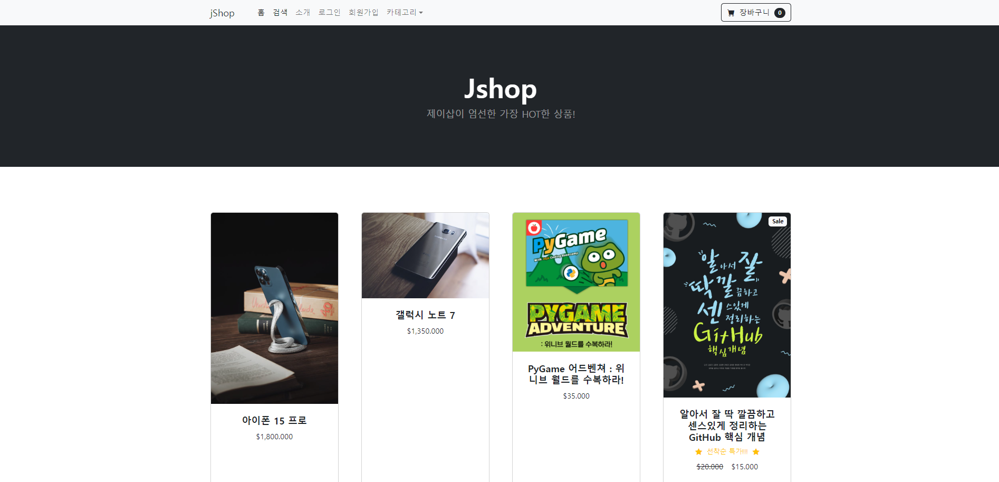
            </td>
            <td>
                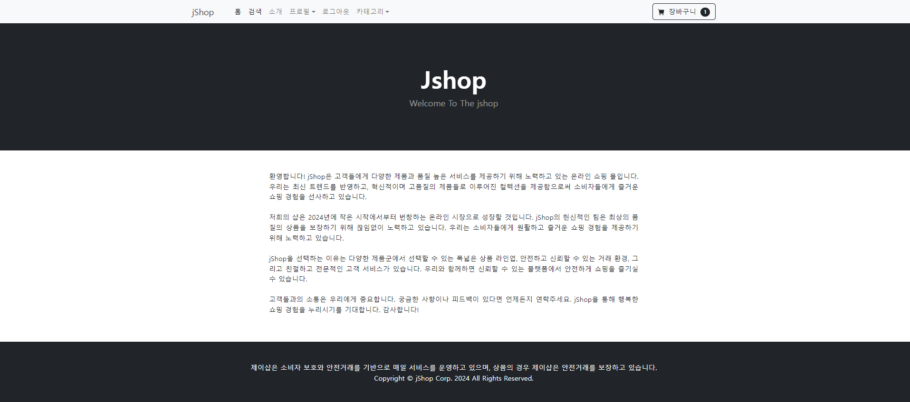
            </td>
        </tr>
        <tr>
            <td>회원가입</td>
            <td>로그인</td>
        </tr>
        <tr>
            <td>
                
            </td>
            <td>
                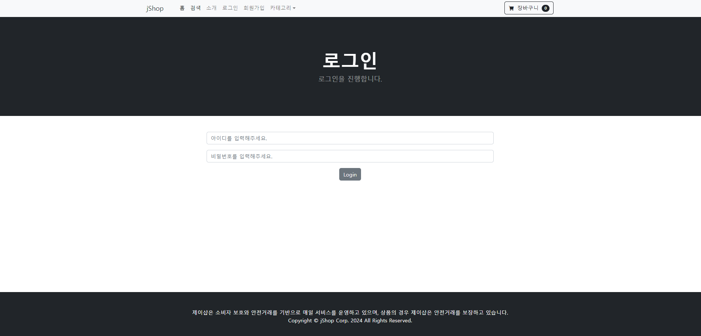
            </td>
        </tr>
        <tr>
            <td>프로필 변경</td>
            <td>사용자 정보 변경</td>
        </tr>
        <tr>
            <td>
                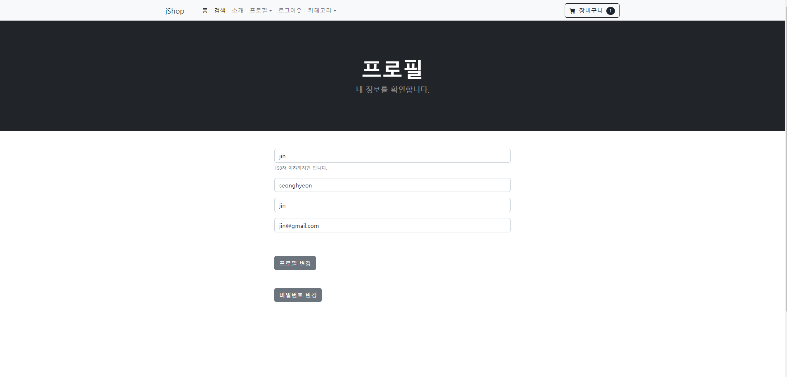
            </td>
            <td>
                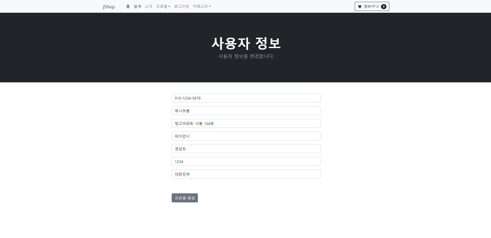
            </td>
        </tr>
        <tr>
            <td>카테고리</td>
            <td>검색</td>
        </tr>
        <tr>
            <td>
                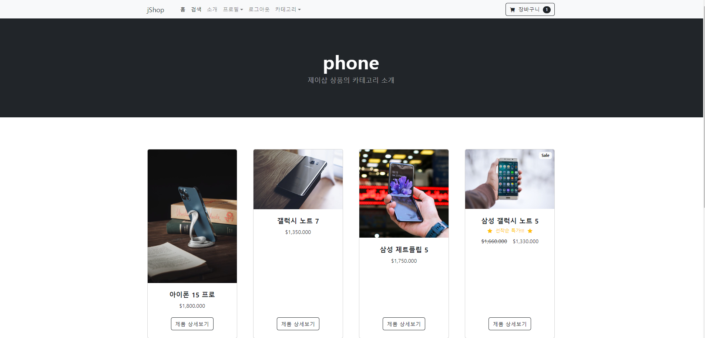
            </td>
            <td>
                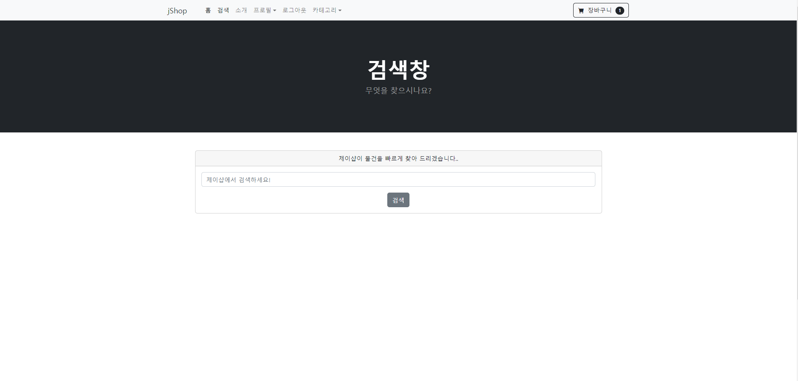
            </td>
        </tr>
        <tr>
            <td>상품</td>
            <td>장바구니</td>
        </tr>
        <tr>
            <td>
	        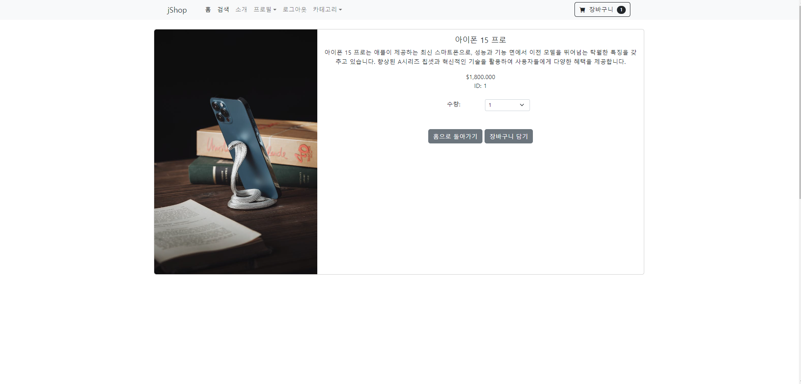
            </td>
            <td>
                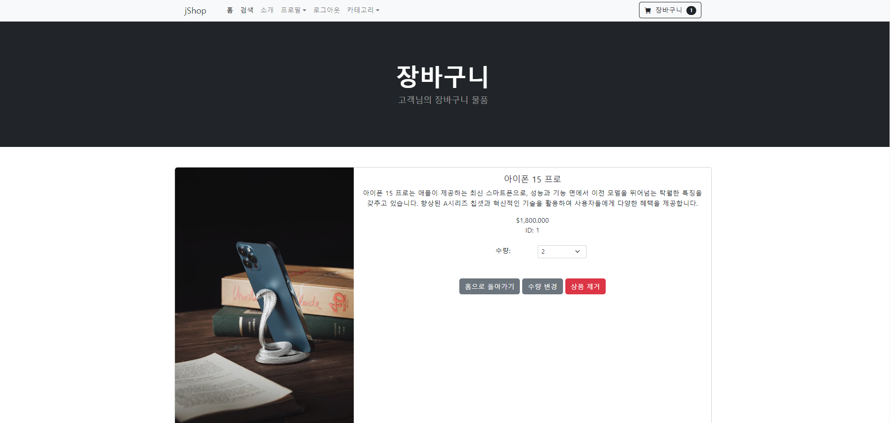
            </td>
        </tr>

    </tbody>
</table>

## 6. 데이터베이스 모델링(ERD)

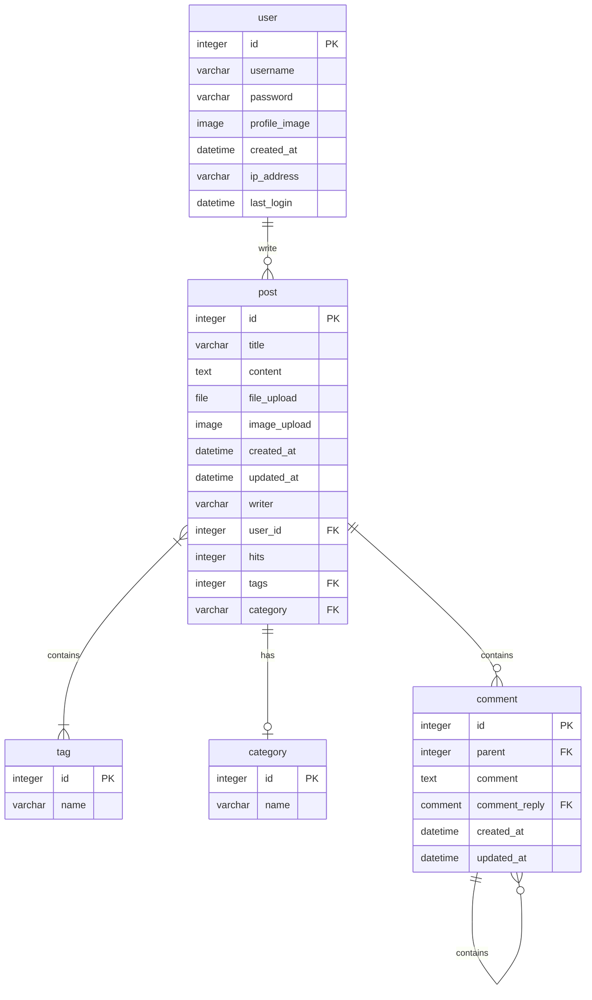
## 7. 메인 기능
- 아래는 가상 시나리오에 따라 jShop의 메인기능을 사용하는 예시입니다.
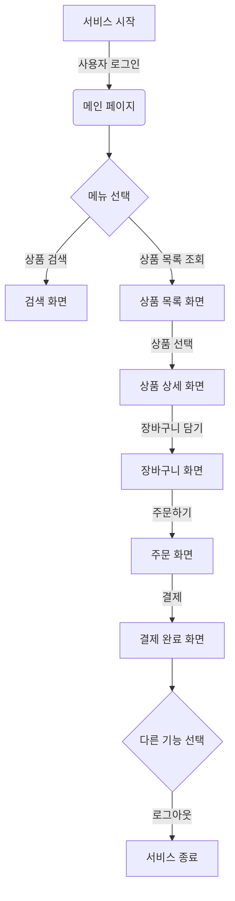
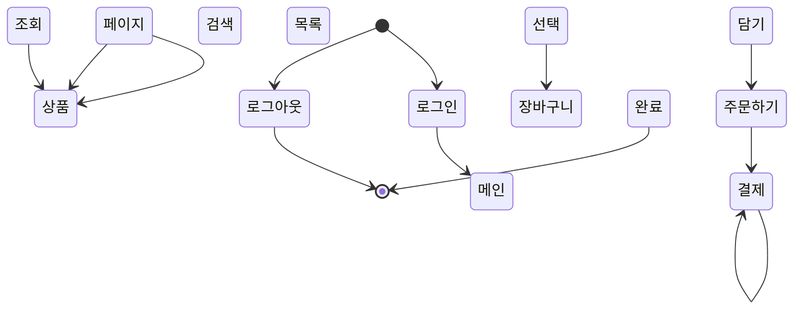
## 8. 에러와 에러 해결 (트러블슈팅)
```
📦templates
 ┣ 📂accounts
 ┃ ┣ 📜login.html
 ┃ ┗ 📜logout.html
 ┣ 📂store
 ┃ ┣ 📜about.html
 ┃ ┣ 📜home.html
 ┃ ┗ 📜navbar.html
 ┗ 📜base.html
```

#### 에러상황 8.1
에러발견 store 와 accounts 로 app이 분리 되어 있는 상황에서 store > navbar.html 에서  페이지의 상단 위 버튼을 클릭하면 login 페이지로 이동하게 하려고 했다. 그 이유로 아래와 같은 코드를 작성했지만 
작동이 되지 않았다. 
```python
<li class="nav-item"><a class="nav-link" href="">Login</a></li>
<li class="nav-item"><a class="nav-link" href="">Logout</a></li>
```

### 에러해결방법

#### 해결 시도 8.1.1
파일이름을 지정 해서 에러를 해결하려함  >>> 결과 실패 

코드변경
```python
<li class="nav-item"><a class="nav-link" href="">Login</a></li>
<li class="nav-item"><a class="nav-link" href="">Logout</a></li>            
```
#### 해결 시도 8.1.2
위의 코드와 추가로 accounts 앱의 urls.py 로 이동하여 URL 네임스페이스지정
```python
    app_name = 'accounts'
```
#### 해결 시도 8.1.3
accounts 의views.py 를 검토 중 아래 코드를 발견하고 html 앞에 폴더 경로를 추가

수정 전
```python
    def login(request):
        return render(request, "login.html")


    def logout(request):
        return render(request, "logout.html")
```

수정 후
```python
    def login(request):
        return render(request, "accounts/login.html")


    def logout(request):
        return render(request, "accounts/logout.html")
```
#### 8.1.4 에러해결 후 회고
처음 store라는 앱에서 모든 html 을 만들어 진행을 하다 기능을 추가 하고 싶은 욕심에 앱을 분리해야겠다고 생각하고 코드를 수정하는 과정에서 발생한 에러이다.

이번 기회로 app_name 을 지정해주는 것에 대한 의미와 효과를 제대로 알게 되었다.
또한 서로 다른 앱에서 html을 연동시키고 싶을 때 url.py 와 views.py 그리고 templates 를 활용하는 방법을 이해했다.


### 에러상황 8.2
navbar에 카테고리 검색창을 만들어 클릭을 통해 카테고리를 분류할려고 시도 했었다. 그때 url 주소에 가시성을 주고 싶어서 한글로 지정을 해보았는데 그래서 아래의 코드로 시작을 하게 되었다.

```python
<li><a class="dropdown-item" href="">휴대폰</a></li>
<li><a class="dropdown-item" href="">도서</a></li>
<li><a class="dropdown-item" href="">과일</a></li>
<li><a class="dropdown-item" href="">스포츠</a></li>
```
#### 해결 시도 8.2.1
quote() , parse 등을 찾아서 해결해 보려고 했으나 계속 찾아본 결과 url 주소 창에는 영어로 하는 것이 좀 더 선호되는 올바른 방향성이다 판단을 하였다. 
그래서 관리자 페이지의 db 에서 category 라는 부분에 한글로 되어있던 데이터들을 영어로 수정하였다. 그리고 코드를 아래와 같이 db name 에 맞게 변경해 주었지만 왜 인가 계속 category 파일을 찾지 못하는 에러가 발생했다.
```python
<li><a class="dropdown-item" href="">휴대폰</a></li>
<li><a class="dropdown-item" href="">도서</a></li>
<li><a class="dropdown-item" href="">과일</a></li>
<li><a class="dropdown-item" href="">스포츠</a></li>
```

#### 8.2.2 에러해결 후 회고
urls.py 와 views.py category 와 연관된 navbar.html, category.html 까지 에러와 관련된 것을 찾기 위해 시간을 쏟았다. 이후 원인을 발견했는데 views.py 에서 return 값에 request 가 빠져있었다....
이것을 해결하기 위해 에러를 찾는데 투자한 순수 시간이 2시간 정도 되었는데 너무 허무하지만 다행이다 찾았다 라는 감정도 들었다. 내가 이걸 왜 안했지? 보다가 보니 이 코드가 category 라는 함수안에 있는 try, except 의 한 부분인데 그 아래있는 redirect 와 혼용을 해서 사용하다보니 그냥 넘어간거 같다. 또한 당연히 이 부분은 체크를 몇번씩 했는데 왜 눈에 보이지 않았을까 라는 생각도 하였고 하지만 이런 작은 오타로 현업에서도 충분히 시간을 보낼 수 있고 꼼꼼한 코드를 작성하기 위해 코드를 체크하는 습관을 더욱 들이자 다짐했다.


수정 전 
```python
        return render(
             "store/category.html", {"products": products, "category": category}
        )
```

수정 후 
```python
        return render(
            requset, "store/category.html", {"products": products, "category": category}
        )
```

### 에러상황 8.3
cart 앱을 만들고 그 속에서 장바구니를 구현하는데 있어서 버튼을 만드는 것에 시간이 많이 걸렸다. 코드는 아래와 같다. 장바구니 속 <a></a> 태그를 통해 이미 구현되어 있던 홈으로 돌아가기 말고 버튼을 두어서 수량을 변경하고 , 상품을 제거하는 기능을 추가하려고 하였다.

```python
<a href="" class="btn btn-secondary">홈으로 돌아가기</a>
<button type="button" value="{{ product.id }}" class="btn btn-secondary" >수량 변경</button>
<button type="button" value="{{ product.id }}" class="btn btn-danger" >상품 제거</button>
```

#### 해결 시도 8.3.1
에러를 해결하기 위해 원인을 찾아 보다가 추가하는 버튼들이 동일한 ID를 가지게 할 수 없다는 것을 히해하였다. 현재 jQuery 와 Ajax를 통하여 세션을 업데이트하고 있음으로 버튼을 서로 구별해야 하는데 이를 수행하기 위해 각 버튼에 고유한 데이터 인덱스 번호를 할당 해야한다는 정보를 찾을 수 있었다. 현재 상품의 ID 번호가 고유한 번호이기에 이를 사용해야 겠다고 생각했다. 그래서 코드에서 value 를 data-index 로 수정을 하였다.

이후 jQuery를 통해 버튼을 클릭한 시기를 알아내어 로직을 작성하기 위해 순서대로 update-cart,delete-product 라는 class 부여 

```python
<a href="" class="btn btn-secondary">홈으로 돌아가기</a>
<button type="button" data-index="{{ product.id }}" class="btn btn-secondary update-cart" >수량 변경</button>
<button type="button" data-index="{{ product.id }}" class="btn btn-danger delete-product" >상품 제거</button>
```

#### 8.3.2 에러해결 후 회고
jQuery 와 Ajex 처음 활용하다 보니 이해도나 개념이 아직 부족한 것을 느꼈다. 에러를 해결 하면서 알게 된 것은 클릭 이벤트가 발생했을 때 스크립트에서 해당 클래스를 찾아서 업데이트하는 함수를 호출하거나, AJAX를 사용하여 서버에 업데이트 요청을 보내는 등의 동적인 작업을 할 때 정말 내가 보고자 하는 것이 고유한 것인지 또 고유하게 사용하고 있는것인지를 잘 확인해야함을 이해했다.
