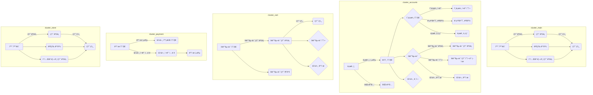
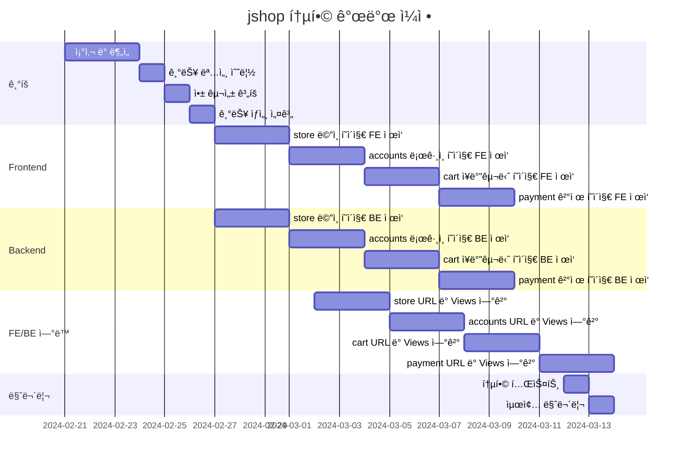
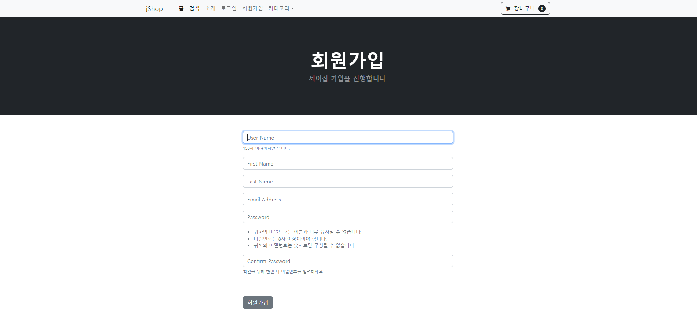
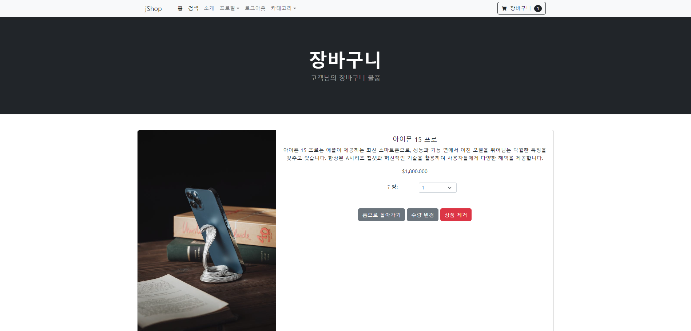
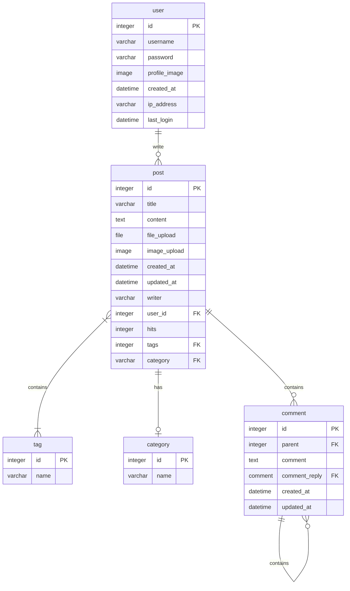
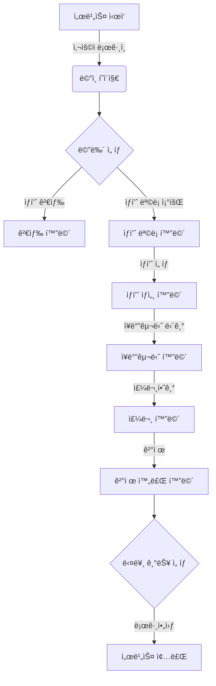
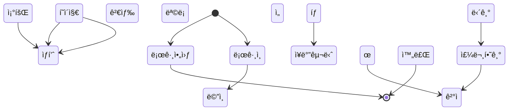

# Django를 활용한 쇼핑몰

## 1. 목표와 기능

### 1.1 목표

- Django를 활용한 ê°œì¸í”„ë¡œì íŠ¸
- 초기 기능 ì •ì˜ ë° í™”ë©´ ê¸°íš ì§„í–‰
- ì‡¼í•‘ëª°ì„ ì£¼ì œë¡œ CRUD 구현하기 
- ëª¨ë†€ë¦¬ì‹ ì•„í‚¤í…ì³ ì„¤ê³„
- Django FBVì„ í†µí•œ 개발
- WBS ë° ERD ì •ì˜ ë° ì‘성 

### 1.2 기능

accounts app:

- Profile 모ë¸: 사용ì 프로필 정보를 ì €ì¥í•©ë‹ˆë‹¤. ì´ë©”ì¼, 비밀번호, 전화번호, 주소 ë“±ì„ ê´€ë¦¬í•  수 ìˆìŠµë‹ˆë‹¤.

store app:

- Category 모ë¸: ìƒí’ˆ 카테고리를 ì €ì¥í•©ë‹ˆë‹¤.
- Customer 모ë¸: ê³ ê° ì •ë³´ë¥¼ ì €ì¥í•©ë‹ˆë‹¤.
- Product 모ë¸: ìƒí’ˆ 정보를 ì €ì¥í•©ë‹ˆë‹¤. 가격, 카테고리, 설명, ì´ë¯¸ì§€ ë“±ì„ í¬í•¨í•©ë‹ˆë‹¤.
- Order 모ë¸: 주문 정보를 ì €ì¥í•©ë‹ˆë‹¤. 주문한 ìƒí’ˆ, ê³ ê°, 수량, 주소, 전화번호, ì£¼ë¬¸ì¼ ë° ì£¼ë¬¸ ìƒíƒœë¥¼ í¬í•¨í•©ë‹ˆë‹¤.

cart app:

- Cart í´ë˜ìŠ¤: ì¥ë°”구니 관련 ê¸°ëŠ¥ì„ ì²˜ë¦¬í•©ë‹ˆë‹¤. ì¥ë°”êµ¬ë‹ˆì— ìƒí’ˆ 추가, ì´ ê°€ê²© 계산, ì¥ë°”êµ¬ë‹ˆì— ë‹´ê¸´ ìƒí’ˆ ì •ë³´ 반환 ë“±ì„ ì²˜ë¦¬í•©ë‹ˆë‹¤.

payment app:

- ShippingAddress 모ë¸: 배송지 주소 정보를 ì €ì¥í•©ë‹ˆë‹¤. 사용ì, ì´ë©”ì¼, 주소 ë“±ì„ ê´€ë¦¬í•  수 ìˆìŠµë‹ˆë‹¤.

## 2. 개발 환경 ë° ë°°í¬ URL
### 2.1 개발 환경

- Web Framework
  - Django 5.0.3 (Python 3.12.1)
  - bootstrap

### 2.2 URL 구조(모놀리ì‹)
- **config (main app)**

| App       | URL                                        | Views Function    | HTML File Name               | Note           |
|-----------|--------------------------------------------|-------------------|------------------------------|----------------|
| config    | 'admin/'                                   | (N/A)             | (N/A)                        | Django Admin   |
| config    | ''                                         | (N/A)             | (N/A)                        | store.urls include|
| config    | 'accounts/'                                | (N/A)             | (N/A)                        | accounts.urls include|
| config    | 'cart/'                                    | (N/A)             | (N/A)                        | cart.urls include|
| config    | 'payment/'                                 | (N/A)             | (N/A)                        | payment.urls include|


- **accounts**

| App       | URL                                        | Views Function    | HTML File Name                        | Note           |
|-----------|--------------------------------------------|-------------------|---------------------------------------|----------------|
| accounts  | 'login/'                                   | login_user        | accounts/login.html                   | ë¡œê·¸ì¸         |
| accounts  | 'logout/'                                  | logout_user       | accounts/logout.html                  | 로그아웃       |
| accounts  | 'register/'                                | register_user     | accounts/register.html                | 회ì›ê°€ì…       |
| accounts  | 'update_user/'                             | update_user       | accounts/update_user.html             | 프로필 변경       |
| accounts  | 'update_password/'                         | update_password   | accounts/update_password.html         | 비밀번호 변경       |
| accounts  | 'update_info/'                             | update_info       | accounts/update_info.html             | 사용ì ì •ë³´ 변경       |

- **cart**

| App       | URL                                        | Views Function    | HTML File Name                        | Note           |
|-----------|--------------------------------------------|-------------------|---------------------------------------|----------------|
| cart      | ''                                         | cart_summary      | cart/cart_summary.html                | ì¥ë°”구니  |
| cart      | 'add/'                                     | cart_add          | (N/A)                                 | ìƒí’ˆ 추가      |
| cart      | 'delete/'                                  | cart_delete       | (N/A)                                 | ìƒí’ˆ ì‚­ì œ      |
| cart      | 'update/'                                  | cart_update       | (N/A)                                 | ìƒí’ˆ 수량 변경 |

- **payment**

| App       | URL                                        | Views Function    | HTML File Name                        | Note           |
|-----------|--------------------------------------------|-------------------|---------------------------------------|----------------|
| pay       | 'payment_success/'                         | payment_success   | payment/payment_success.html          | 결제 화면 |

- **store**

| App       | URL                                        | Views Function    | HTML File Name                        | Note           |
|-----------|--------------------------------------------|-------------------|---------------------------------------|----------------|
| store     | ''                                         | home              | store/home.html                       | 홈화면          |
| store     | 'about/'                                   | about             | store/about.html                      | 소개 화면             |
| store     | 'product/<int:pk>'                         | product           | store/product.html                    | ìƒí’ˆ ìƒì„¸ 화면  |
| store     | 'category/<str:s>'                         | category          | store/category.html                   | ìƒí’ˆë³„ 카테고리 í˜ì´ì§€ |
| store     | 'category_summary/'                        | category_summary  | store/category_summary.html           | ì „ì²´ 카테고리 í˜ì´ì§€ |
| store     | 'search/'                                  | search            | store/search.html                     | 검색 ê²°ê³¼ í˜ì´ì§€ |


## 3. 요구사항 명세와 기능 명세


```mermaid
graph TB

subgraph cluster_main
  A[홈 화면] -->|ìƒí’ˆ 목ë¡| B(ìƒí’ˆ 목ë¡)
  A --> C(검색 결과)
  A --> D(카테고리 별 ìƒí’ˆ 목ë¡)
  B -->|ìƒí’ˆ ìƒì„¸| E(ìƒí’ˆ ìƒì„¸)
  C --> E
  D --> E
end

subgraph cluster_accounts
  F[로그ì¸] -->|ë¡œê·¸ì¸ ì„±ê³µ| G(ë©”ì¸ í˜ì´ì§€)
  F -->|회ì›ê°€ì…| H(회ì›ê°€ì…)
  G --> I{프로필 í˜ì´ì§€}
  G --> J{ì¥ë°”구니}
  G --> K{주문 내역}
  I -->|프로필 정보| I1(프로필 정보 수정)
  I -->|비밀번호 변경| I2(비밀번호 변경)
  I -->|로그아웃| I3(로그아웃)
  J -->|ì¥ë°”구니 목ë¡| J1(ì¥ë°”구니 ìƒí’ˆ 목ë¡)
  J -->|ì¥ë°”구니 수정| J2(ì¥ë°”구니 ìƒí’ˆ 수정 ë° ì‚­ì œ)
  J -->|주문 결제| J3(주문 결제)
end

subgraph cluster_cart
  L[ì¥ë°”구니 í˜ì´ì§€] -->|ì¥ë°”구니 ìƒí’ˆ 목ë¡| M(ì¥ë°”구니 ìƒí’ˆ 목ë¡)
  L --> N(ì¥ë°”구니 ìƒí’ˆ 추가)
  M -->|ìƒí’ˆ ìƒì„¸| O(ìƒí’ˆ ìƒì„¸)
  M --> P{ì¥ë°”구니 수정}
  M --> Q{주문 결제}
end

subgraph cluster_payment
  R[ê²°ì œ í˜ì´ì§€] -->|ê²°ì œ 성공| S(주문 완료 í˜ì´ì§€)
  R -->|주문 ì •ë³´ ì…ë ¥| T(주문 ì •ë³´ ì…ë ¥)
  T --> U(결제 성공)
end

subgraph cluster_store
  V[홈 화면] -->|ìƒí’ˆ 목ë¡| W(ìƒí’ˆ 목ë¡)
  V --> X(검색 결과)
  V --> Y(카테고리 별 ìƒí’ˆ 목ë¡)
  W -->|ìƒí’ˆ ìƒì„¸| Z(ìƒí’ˆ ìƒì„¸)
  X --> Z
  Y --> Z
end

```

## 4. 프로ì íŠ¸ 구조와 개발 ì¼ì •
### 4.1 프로ì íŠ¸ 구조

📦jShop
 ┣ 📂accounts
 ┃ ┣ 📂migrations
 ┃ ┃ ┣ 📂__pycache__
 ┃ ┃ ┃ ┣ 📜0001_initial.cpython-312.pyc
 ┃ ┃ ┃ ┣ 📜0002_profile_old_cart.cpython-312.pyc
 ┃ ┃ ┃ ┗ 📜__init__.cpython-312.pyc
 ┃ ┃ ┣ 📜0001_initial.py
 ┃ ┃ ┣ 📜0002_profile_old_cart.py
 ┃ ┃ ┗ 📜__init__.py
 ┃ ┣ 📂__pycache__
 ┃ ┃ ┣ 📜admin.cpython-312.pyc
 ┃ ┃ ┣ 📜apps.cpython-312.pyc
 ┃ ┃ ┣ 📜forms.cpython-312.pyc
 ┃ ┃ ┣ 📜models.cpython-312.pyc
 ┃ ┃ ┣ 📜urls.cpython-312.pyc
 ┃ ┃ ┣ 📜views.cpython-312.pyc
 ┃ ┃ ┗ 📜__init__.cpython-312.pyc
 ┃ ┣ 📜admin.py
 ┃ ┣ 📜apps.py
 ┃ ┣ 📜forms.py
 ┃ ┣ 📜models.py
 ┃ ┣ 📜tests.py
 ┃ ┣ 📜urls.py
 ┃ ┣ 📜views.py
 ┃ ┗ 📜__init__.py
 ┣ 📂cart
 ┃ ┣ 📂migrations
 ┃ ┃ ┣ 📂__pycache__
 ┃ ┃ ┃ ┗ 📜__init__.cpython-312.pyc
 ┃ ┃ ┗ 📜__init__.py
 ┃ ┣ 📂__pycache__
 ┃ ┃ ┣ 📜admin.cpython-312.pyc
 ┃ ┃ ┣ 📜apps.cpython-312.pyc
 ┃ ┃ ┣ 📜cart.cpython-312.pyc
 ┃ ┃ ┣ 📜context_processors.cpython-312.pyc
 ┃ ┃ ┣ 📜models.cpython-312.pyc
 ┃ ┃ ┣ 📜urls.cpython-312.pyc
 ┃ ┃ ┣ 📜views.cpython-312.pyc
 ┃ ┃ ┗ 📜__init__.cpython-312.pyc
 ┃ ┣ 📜admin.py
 ┃ ┣ 📜apps.py
 ┃ ┣ 📜cart.py
 ┃ ┣ 📜context_processors.py
 ┃ ┣ 📜models.py
 ┃ ┣ 📜tests.py
 ┃ ┣ 📜urls.py
 ┃ ┣ 📜views.py
 ┃ ┗ 📜__init__.py
 ┣ 📂config
 ┃ ┣ 📂__pycache__
 ┃ ┃ ┣ 📜settings.cpython-312.pyc
 ┃ ┃ ┣ 📜urls.cpython-312.pyc
 ┃ ┃ ┣ 📜wsgi.cpython-312.pyc
 ┃ ┃ ┗ 📜__init__.cpython-312.pyc
 ┃ ┣ 📜asgi.py
 ┃ ┣ 📜settings.py
 ┃ ┣ 📜urls.py
 ┃ ┣ 📜wsgi.py
 ┃ ┗ 📜__init__.py
 ┣ 📂media
 ┃ ┗ 📂uploads
 ┃ ┃ ┗ 📂product
 ┃ ┃ ┃ ┣ 📜PyGame_어드벤ì³_위니브_월드를_수복하ë¼.png
 ┃ ┃ ┃ ┣ 📜React_Hook_들어오네.png
 ┃ ┃ ┃ ┣ 📜갤럭시_노트_5.jpg
 ┃ ┃ ┃ ┣ 📜갤럭시_노트_7.jpg
 ┃ ┃ ┃ ┣ 📜글러브.jpg
 ┃ ┃ ┃ ┣ 📜ë†êµ¬ê³µ.jpg
 ┃ ┃ ┃ ┣ 📜딸기.jpg
 ┃ ┃ ┃ ┣ 📜ë¼ì„.jpg
 ┃ ┃ ┃ ┣ 📜ë¼ì„_CuVwFzn.jpg
 ┃ ┃ ┃ ┣ 📜레몬.jpg
 ┃ ┃ ┃ ┣ 📜바나나.jpg
 ┃ ┃ ┃ ┣ 📜방울토마토.jpg
 ┃ ┃ ┃ ┣ 📜배드민턴채.jpg
 ┃ ┃ ┃ ┣ 📜블루베리.jpg
 ┃ ┃ ┃ ┣ 📜산딸기.jpg
 ┃ ┃ ┃ ┣ 📜셔틀콕.jpg
 ┃ ┃ ┃ ┣ 📜수박.jpg
 ┃ ┃ ┃ ┣ 📜아ì´í°15.jpg
 ┃ ┃ ┃ ┣ 📜아ì´í°_11.jpg
 ┃ ┃ ┃ ┣ 📜아ì´í°_14.jpg
 ┃ ┃ ┃ ┣ 📜악력운ë™ê¸°.jpg
 ┃ ┃ ┃ ┣ 📜알아서_ì˜_ë”±_ê¹”ë”하고_센스ìˆê²Œ_정리하는_GitHub_핵심_ê°œë….png
 ┃ ┃ ┃ ┣ 📜오렌지.jpg
 ┃ ┃ ┃ ┣ 📜요가매트.jpg
 ┃ ┃ ┃ ┣ 📜웹_접근성_왭Why-Web.png
 ┃ ┃ ┃ ┣ 📜위니브_월드_새로운_시대.png
 ┃ ┃ ┃ ┣ 📜제트플립_5.jpg
 ┃ ┃ ┃ ┣ 📜줄넘기.jpg
 ┃ ┃ ┃ ┣ 📜ì§ë³¼.jpg
 ┃ ┃ ┃ ┣ 📜축구공.jpg
 ┃ ┃ ┃ ┣ 📜케틀벨.jpg
 ┃ ┃ ┃ ┣ 📜케틀벨_16kg.jpg
 ┃ ┃ ┃ ┣ 📜케틀벨_32kg.jpg
 ┃ ┃ ┃ ┣ 📜케틀벨_8kg.jpg
 ┃ ┃ ┃ ┣ 📜키위.jpg
 ┃ ┃ ┃ ┣ 📜타ì…스í¬ë¦½íŠ¸_ë„Œ_ë‚´_타ì….png
 ┃ ┃ ┃ ┗ 📜풋사과.jpg
 ┣ 📂payment
 ┃ ┣ 📂migrations
 ┃ ┃ ┣ 📂__pycache__
 ┃ ┃ ┃ ┣ 📜0001_initial.cpython-312.pyc
 ┃ ┃ ┃ ┣ 📜0002_alter_shippingaddress_options.cpython-312.pyc
 ┃ ┃ ┃ ┗ 📜__init__.cpython-312.pyc
 ┃ ┃ ┣ 📜0001_initial.py
 ┃ ┃ ┣ 📜0002_alter_shippingaddress_options.py
 ┃ ┃ ┗ 📜__init__.py
 ┃ ┣ 📂__pycache__
 ┃ ┃ ┣ 📜admin.cpython-312.pyc
 ┃ ┃ ┣ 📜apps.cpython-312.pyc
 ┃ ┃ ┣ 📜models.cpython-312.pyc
 ┃ ┃ ┣ 📜urls.cpython-312.pyc
 ┃ ┃ ┣ 📜views.cpython-312.pyc
 ┃ ┃ ┗ 📜__init__.cpython-312.pyc
 ┃ ┣ 📜admin.py
 ┃ ┣ 📜apps.py
 ┃ ┣ 📜models.py
 ┃ ┣ 📜tests.py
 ┃ ┣ 📜urls.py
 ┃ ┣ 📜views.py
 ┃ ┗ 📜__init__.py
 ┣ 📂static
 ┃ ┣ 📂assets
 ┃ ┃ ┗ 📜favicon.ico
 ┃ ┣ 📂css
 ┃ ┃ ┗ 📜styles.css
 ┃ ┣ 📂js
 ┃ ┃ ┗ 📜scripts.js
 ┃ ┗ 📜index.html
 ┣ 📂store
 ┃ ┣ 📂migrations
 ┃ ┃ ┣ 📂__pycache__
 ┃ ┃ ┃ ┣ 📜0001_initial.cpython-312.pyc
 ┃ ┃ ┃ ┣ 📜0002_alter_product_price.cpython-312.pyc
 ┃ ┃ ┃ ┣ 📜0003_alter_category_options_product_is_sale_and_more.cpython-312.pyc
 ┃ ┃ ┃ ┣ 📜0004_profile.cpython-312.pyc
 ┃ ┃ ┃ ┣ 📜0005_delete_profile.cpython-312.pyc
 ┃ ┃ ┃ ┗ 📜__init__.cpython-312.pyc
 ┃ ┃ ┣ 📜0001_initial.py
 ┃ ┃ ┣ 📜0002_alter_product_price.py
 ┃ ┃ ┣ 📜0003_alter_category_options_product_is_sale_and_more.py
 ┃ ┃ ┣ 📜0004_profile.py
 ┃ ┃ ┣ 📜0005_delete_profile.py
 ┃ ┃ ┗ 📜__init__.py
 ┃ ┣ 📂__pycache__
 ┃ ┃ ┣ 📜admin.cpython-312.pyc
 ┃ ┃ ┣ 📜apps.cpython-312.pyc
 ┃ ┃ ┣ 📜models.cpython-312.pyc
 ┃ ┃ ┣ 📜urls.cpython-312.pyc
 ┃ ┃ ┣ 📜views.cpython-312.pyc
 ┃ ┃ ┗ 📜__init__.cpython-312.pyc
 ┃ ┣ 📜admin.py
 ┃ ┣ 📜apps.py
 ┃ ┣ 📜models.py
 ┃ ┣ 📜tests.py
 ┃ ┣ 📜urls.py
 ┃ ┣ 📜views.py
 ┃ ┗ 📜__init__.py
 ┣ 📂templates
 ┃ ┣ 📂accounts
 ┃ ┃ ┣ 📜login.html
 ┃ ┃ ┣ 📜register.html
 ┃ ┃ ┣ 📜update_info.html
 ┃ ┃ ┣ 📜update_password.html
 ┃ ┃ ┗ 📜update_user.html
 ┃ ┣ 📂cart
 ┃ ┃ ┗ 📜cart_summary.html
 ┃ ┣ 📂payment
 ┃ ┃ ┗ 📜payment_success.html
 ┃ ┣ 📂store
 ┃ ┃ ┣ 📜about.html
 ┃ ┃ ┣ 📜category.html
 ┃ ┃ ┣ 📜category_summary.html
 ┃ ┃ ┣ 📜home.html
 ┃ ┃ ┣ 📜navbar.html
 ┃ ┃ ┣ 📜product.html
 ┃ ┃ ┗ 📜search.html
 ┃ ┗ 📜base.html
 ┣ 📜.env
 ┣ 📜db.sqlite3
 ┗ 📜manage.py
 

### 4.1 개발 ì¼ì •(WBS)

```mermaid
gantt
    title jshop 통합 개발 ì¼ì •
    dateFormat YY-MM-DD
    section 기íš
        조사 ë° ë¶„ì„ :2024-02-21, 3d
        기능 명세 수립 :2024-02-24, 1d
        앱 구성 ê³„íš :2024-02-25, 1d
        기능 ìƒì„¸ 설계 :2024-02-26, 1d
    section Frontend
        store ë©”ì¸ í˜ì´ì§€ FE ì œì‘ :2024-02-27, 3d
        accounts ë¡œê·¸ì¸ í˜ì´ì§€ FE ì œì‘ :2024-03-01, 3d
        cart ì¥ë°”구니 í˜ì´ì§€ FE ì œì‘ :2024-03-04, 3d
        payment ê²°ì œ í˜ì´ì§€ FE ì œì‘ :2024-03-07, 3d
    section Backend
        store ë©”ì¸ í˜ì´ì§€ BE ì œì‘ :2024-02-27, 3d
        accounts ë¡œê·¸ì¸ í˜ì´ì§€ BE ì œì‘ :2024-03-01, 3d
        cart ì¥ë°”구니 í˜ì´ì§€ BE ì œì‘ :2024-03-04, 3d
        payment ê²°ì œ í˜ì´ì§€ BE ì œì‘ :2024-03-07, 3d
    section FE/BE ì—°ë™
        store URL ë° Views ì—°ê²° :2024-03-02, 3d
        accounts URL ë° Views ì—°ê²° :2024-03-05, 3d
        cart URL ë° Views ì—°ê²° :2024-03-08, 3d
        payment URL ë° Views ì—°ê²° :2024-03-11, 3d
    section 마무리
        통합 테스트 :2024-03-12, 1d
        최종 마무리 :2024-03-13, 1d

```
## 5. 와ì´ì–´í”„ë ˆì„ / UI / BM

### 5.1 와ì´ì–´í”„ë ˆì„


### 5.2 화면 설계

## 화면 설계

<table>
    <tbody>
        <tr>
            <td>ë©”ì¸</td>
            <td>소개</td>
        </tr>
        <tr>
            <td>
                
            </td>
            <td>
                
            </td>
        </tr>
        <tr>
            <td>회ì›ê°€ì…</td>
            <td>로그ì¸</td>
        </tr>
        <tr>
            <td>
                
            </td>
            <td>
                
            </td>
        </tr>
        <tr>
            <td>프로필 변경</td>
            <td>사용ì ì •ë³´ 변경</td>
        </tr>
        <tr>
            <td>
                
            </td>
            <td>
                
            </td>
        </tr>
        <tr>
            <td>카테고리</td>
            <td>검색</td>
        </tr>
        <tr>
            <td>
                
            </td>
            <td>
                
            </td>
        </tr>
        <tr>
            <td>ìƒí’ˆ</td>
            <td>ì¥ë°”구니</td>
        </tr>
        <tr>
            <td>
	        
            </td>
            <td>
                
            </td>
        </tr>

    </tbody>
</table>

## 6. ë°ì´í„°ë² ì´ìŠ¤ 모ë¸ë§(ERD)
* ì•„ë˜ ERD는 머메ì´ë“œë¥¼ 사용했습니다.

```mermaid
erDiagram
    user ||--o{ post : write
    user {
      integer id PK
      varchar username
      varchar password
      image profile_image
      datetime created_at
      varchar ip_address
      datetime last_login
    }
    post }|--|{ tag : contains
    post ||--o| category : has
    post {
      integer id PK
      varchar title
      text content
      file file_upload
      image image_upload
      datetime created_at
      datetime updated_at
      varchar writer
      integer user_id FK
      integer hits
      integer tags FK
      varchar category FK
    }
    post ||--o{ comment : contains
    comment ||--o{ comment : contains
    comment {
      integer id PK
      integer parent FK
      text comment
      comment comment_reply FK
      datetime created_at
      datetime updated_at
    }
    
    tag {
      integer id PK
      varchar name
    }
    
    category {
      integer id PK
      varchar name
    }

```
## 7. ë©”ì¸ ê¸°ëŠ¥
- ì•„ë˜ëŠ” ê°€ìƒ ì‹œë‚˜ë¦¬ì˜¤ì— ë”°ë¼ jShopì˜ ë©”ì¸ê¸°ëŠ¥ì„ 사용하는 예시ì…니다.

```mermaid
graph TD
    A[서비스 ì‹œì‘] -->|사용ì 로그ì¸| B(ë©”ì¸ í˜ì´ì§€)
    B --> C{메뉴 ì„ íƒ}
    C -->|ìƒí’ˆ 검색| D[검색 화면]
    C -->|ìƒí’ˆ ëª©ë¡ ì¡°íšŒ| E[ìƒí’ˆ ëª©ë¡ í™”ë©´]
    E -->|ìƒí’ˆ ì„ íƒ| F[ìƒí’ˆ ìƒì„¸ 화면]
    F -->|ì¥ë°”구니 담기| G[ì¥ë°”구니 화면]
    G -->|주문하기| H[주문 화면]
    H -->|결제| I[결제 완료 화면]
    I --> J{다른 기능 ì„ íƒ}
    J -->|로그아웃| K[서비스 종료]
```

```mermaid
stateDiagram-v2
    [*] --> 로그ì¸
    ë¡œê·¸ì¸ --> ë©”ì¸ í˜ì´ì§€
    ë©”ì¸ í˜ì´ì§€ --> ìƒí’ˆ 검색
    ë©”ì¸ í˜ì´ì§€ --> ìƒí’ˆ ëª©ë¡ ì¡°íšŒ
    ìƒí’ˆ ëª©ë¡ ì¡°íšŒ --> ìƒí’ˆ ì„ íƒ
    ìƒí’ˆ ì„ íƒ --> ì¥ë°”구니 담기
    ì¥ë°”구니 담기 --> 주문하기
    주문하기 --> 결제
    결제 --> 결제 완료
    결제 완료 --> [*]
    [*] --> 로그아웃
    로그아웃 --> [*]

```
## 8. ì—러와 ì—러 í•´ê²° (트러블슈팅)

📦templates
 ┣ 📂accounts
 ┃ ┣ 📜login.html
 ┃ ┗ 📜logout.html
 ┣ 📂store
 ┃ ┣ 📜about.html
 ┃ ┣ 📜home.html
 ┃ ┗ 📜navbar.html
 ┗ 📜base.html

#### ì—러ìƒí™© 8.1
ì—러발견 store 와 accounts ë¡œ appì´ ë¶„ë¦¬ ë˜ì–´ ìˆëŠ” ìƒí™©ì—ì„œ store > navbar.html ì—ì„œ  í˜ì´ì§€ì˜ ìƒë‹¨ 위 ë²„íŠ¼ì„ í´ë¦­í•˜ë©´ login í˜ì´ì§€ë¡œ ì´ë™í•˜ê²Œ 하려고 했다. ê·¸ ì´ìœ ë¡œ ì•„ë˜ì™€ ê°™ì€ ì½”ë“œë¥¼ ì‘성했지만 
ì‘ë™ì´ ë˜ì§€ 않았다. 
```python
<li class="nav-item"><a class="nav-link" href="">Login</a></li>
<li class="nav-item"><a class="nav-link" href="">Logout</a></li>
```

### ì—러해결방법

#### í•´ê²° ì‹œë„ 8.1.1
파ì¼ì´ë¦„ì„ ì§€ì • í•´ì„œ ì—러를 해결하려함  >>> ê²°ê³¼ 실패 

코드변경
```python
<li class="nav-item"><a class="nav-link" href="">Login</a></li>
<li class="nav-item"><a class="nav-link" href="">Logout</a></li>
                
```
#### í•´ê²° ì‹œë„ 8.1.2
ìœ„ì˜ ì½”ë“œì™€ 추가로 accounts ì•±ì˜ urls.py ë¡œ ì´ë™í•˜ì—¬ URL 네ì„스í˜ì´ìŠ¤ì§€ì •
```python
    app_name = 'accounts'
```
#### í•´ê²° ì‹œë„ 8.1.3
accounts ì˜views.py 를 검토 중 ì•„ë˜ ì½”ë“œë¥¼ 발견하고 html ì•ì— í´ë” 경로를 추가

수정 전
```python
    def login(request):
        return render(request, "login.html")


    def logout(request):
        return render(request, "logout.html")
```

수정 후
```python
    def login(request):
        return render(request, "accounts/login.html")


    def logout(request):
        return render(request, "accounts/logout.html")
```
#### 8.1.4 ì—러해결 후 회고
ì²˜ìŒ storeë¼ëŠ” 앱ì—ì„œ 모든 html ì„ ë§Œë“¤ì–´ ì§„í–‰ì„ í•˜ë‹¤ ê¸°ëŠ¥ì„ ì¶”ê°€ 하고 ì‹¶ì€ ìš•ì‹¬ì— ì•±ì„ ë¶„ë¦¬í•´ì•¼ê² ë‹¤ê³  ìƒê°í•˜ê³  코드를 수정하는 과정ì—ì„œ ë°œìƒí•œ ì—러ì´ë‹¤.

ì´ë²ˆ 기회로 app_name ì„ ì§€ì •í•´ì£¼ëŠ” ê²ƒì— ëŒ€í•œ ì˜ë¯¸ì™€ 효과를 제대로 알게 ë˜ì—ˆë‹¤.
ë˜í•œ 서로 다른 앱ì—ì„œ htmlì„ ì—°ë™ì‹œí‚¤ê³  ì‹¶ì„ ë•Œ url.py 와 views.py 그리고 templates 를 활용하는 ë°©ë²•ì„ ì´í•´í–ˆë‹¤.


### ì—러ìƒí™© 8.2
navbarì— ì¹´í…Œê³ ë¦¬ ê²€ìƒ‰ì°½ì„ ë§Œë“¤ì–´ í´ë¦­ì„ 통해 카테고리를 분류할려고 ì‹œë„ í–ˆì—ˆë‹¤. 그때 url ì£¼ì†Œì— ê°€ì‹œì„±ì„ ì£¼ê³  싶어서 한글로 ì§€ì •ì„ í•´ë³´ì•˜ëŠ”ë° ê·¸ë˜ì„œ ì•„ë˜ì˜ 코드로 ì‹œì‘ì„ í•˜ê²Œ ë˜ì—ˆë‹¤.

```python
<li><a class="dropdown-item" href="">휴대í°</a></li>
<li><a class="dropdown-item" href="">ë„ì„œ</a></li>
<li><a class="dropdown-item" href="">ê³¼ì¼</a></li>
<li><a class="dropdown-item" href="">스í¬ì¸ </a></li>
```
#### í•´ê²° ì‹œë„ 8.2.1
quote() , parse ë“±ì„ ì°¾ì•„ì„œ í•´ê²°í•´ 보려고 했으나 ê³„ì† ì°¾ì•„ë³¸ ê²°ê³¼ url 주소 ì°½ì—는 ì˜ì–´ë¡œ 하는 ê²ƒì´ ì¢€ ë” ì„ í˜¸ë˜ëŠ” 올바른 방향성ì´ë‹¤ íŒë‹¨ì„ 하였다. 
ê·¸ë˜ì„œ 관리ì í˜ì´ì§€ì˜ db ì—ì„œ category ë¼ëŠ” ë¶€ë¶„ì— í•œê¸€ë¡œ ë˜ì–´ìˆë˜ ë°ì´í„°ë“¤ì„ ì˜ì–´ë¡œ 수정하였다. 그리고 코드를 ì•„ë˜ì™€ ê°™ì´ db name ì— ë§ê²Œ 변경해 주었지만 왜 ì¸ê°€ ê³„ì† category 파ì¼ì„ 찾지 못하는 ì—러가 ë°œìƒí–ˆë‹¤.
```python
<li><a class="dropdown-item" href="">휴대í°</a></li>
<li><a class="dropdown-item" href="">ë„ì„œ</a></li>
<li><a class="dropdown-item" href="">ê³¼ì¼</a></li>
<li><a class="dropdown-item" href="">스í¬ì¸ </a></li>
```

#### 8.2.2 ì—러해결 후 회고
urls.py 와 views.py category 와 ì—°ê´€ëœ navbar.html, category.html 까지 ì—러와 ê´€ë ¨ëœ ê²ƒì„ ì°¾ê¸° 위해 ì‹œê°„ì„ ìŸì•˜ë‹¤. ì´í›„ ì›ì¸ì„ ë°œê²¬í–ˆëŠ”ë° views.py ì—ì„œ return ê°’ì— request ê°€ ë¹ ì ¸ìˆì—ˆë‹¤....
ì´ê²ƒì„ 해결하기 위해 ì—러를 ì°¾ëŠ”ë° íˆ¬ìí•œ 순수 ì‹œê°„ì´ 2시간 ì •ë„ ë˜ì—ˆëŠ”ë° ë„ˆë¬´ 허무하지만 다행ì´ë‹¤ 찾았다 ë¼ëŠ” ê°ì •ë„ 들었다. ë‚´ê°€ ì´ê±¸ 왜 안했지? 보다가 보니 ì´ ì½”ë“œê°€ category ë¼ëŠ” í•¨ìˆ˜ì•ˆì— ìˆëŠ” try, except ì˜ í•œ 부분ì¸ë° ê·¸ ì•„ë˜ìˆëŠ” redirect 와 í˜¼ìš©ì„ í•´ì„œ 사용하다보니 그냥 넘어간거 같다. ë˜í•œ ë‹¹ì—°íˆ ì´ ë¶€ë¶„ì€ ì²´í¬ë¥¼ 몇번씩 í–ˆëŠ”ë° ì™œ ëˆˆì— ë³´ì´ì§€ 않았ì„까 ë¼ëŠ” ìƒê°ë„ 하였고 하지만 ì´ëŸ° ì‘ì€ ì˜¤íƒ€ë¡œ 현업ì—ì„œë„ ì¶©ë¶„íˆ ì‹œê°„ì„ ë³´ë‚¼ 수 ìˆê³  꼼꼼한 코드를 ì‘성하기 위해 코드를 ì²´í¬í•˜ëŠ” ìŠµê´€ì„ ë”ìš± 들ì´ì 다ì§í–ˆë‹¤.


수정 전 
```python
        return render(
             "store/category.html", {"products": products, "category": category}
        )
```

수정 후 
```python
        return render(
            requset, "store/category.html", {"products": products, "category": category}
        )
```